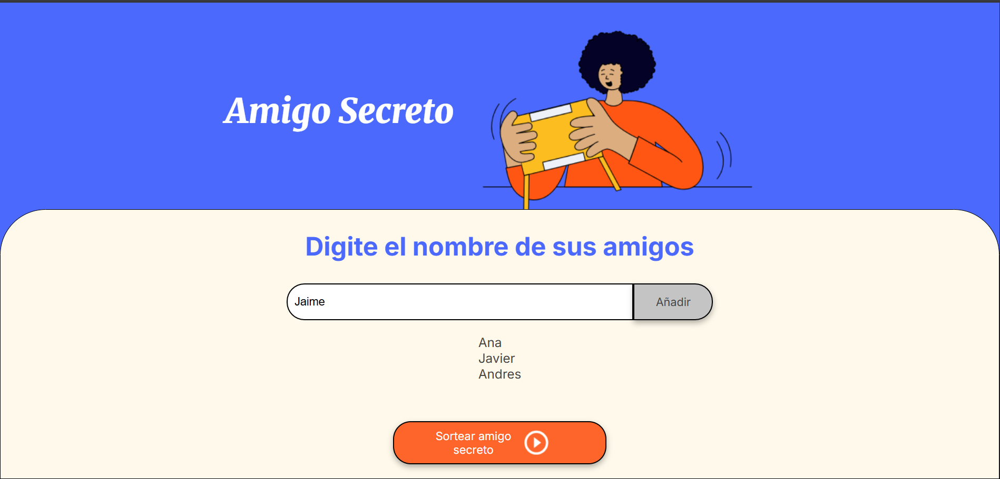
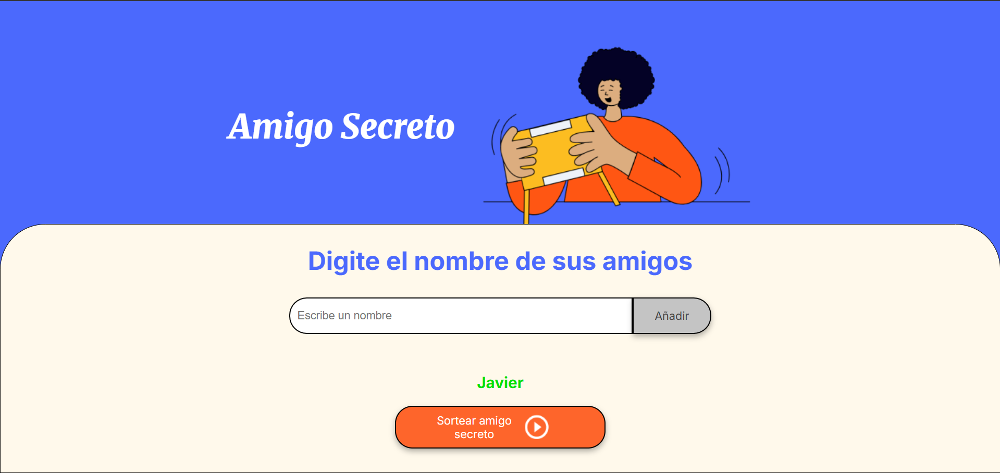

---

# Challenge Logica de programación: Sorteo de Amigo Secreto

Una aplicación web interactiva desarrollada con **HTML, CSS y JavaScript**, que permite realizar de forma simple un **sorteo de amigo secreto**. El objetivo de este challenge es poner en practica las habilidades y conocimientos aprendidos en el **curso de Logica de programacion** y manejo de arreglos impartido por **ALURA - Latam**

---

## Funciones

✅ Agregar nombres a la lista
✅ Evitar nombres duplicados
✅ Realizar un sorteo aleatorio de un amigo
✅ Mostrar el resultado en pantalla
✅ Reiniciar el sorteo automáticamente si se intenta agregar un nuevo nombre

---

##  Vista previa


---

## 📂 Estructura del Proyecto

```
amigo-secreto/
│
├── index.html        # Página principal
├── style.css         # Estilos de la interfaz
├── app.js            # Lógica en JavaScript
└── assets/           # Imágenes e íconos utilizados
    └── amigo-secreto.png
    └── play_circle_outline.png
```

---

## Lenguajes utilizadas

* HTML
* CSS
* JavaScript

---

##  Cómo ejecutar el proyecto

1. Clona este repositorio:

```bash
git clone https://github.com/tu-usuario/amigo-secreto.git
```

2. Abre el archivo `index.html` en tu navegador favorito.
3. Agrega los nombres de los participantes.
4. Haz clic en **“Sortear amigo secreto”**.

---

## Recomendaciones

* Usa nombres distintos y no vacíos.
* Se reinicia el sorteo automaticamente al añadir un nuevo amigo despues de ya haber hecho un sorteo.


---

##  Autor

**\[Alfonso Escobar Rodríguez]**
Desarrollado como challenge de logica de programación.

---

## 📄 Licencia

Este proyecto está bajo la licencia ALURA - Latam

---
